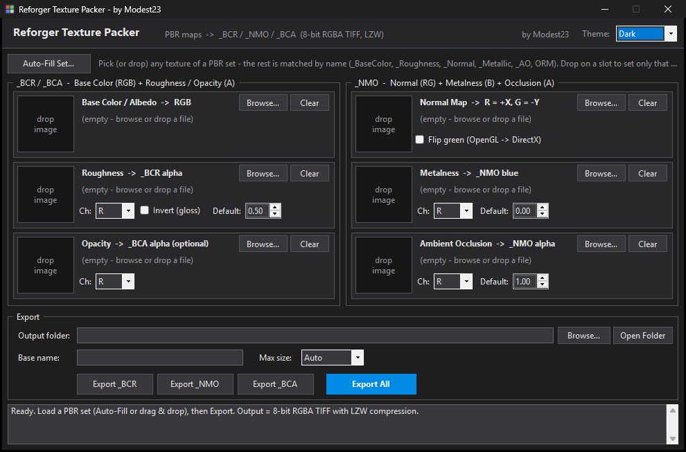
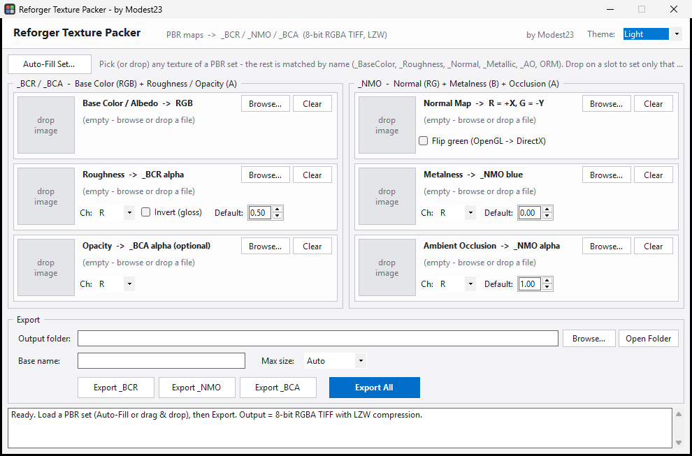

# Reforger Texture Packer

**by Modest23** (ReforgedZ)

A small Windows desktop tool that packs loose PBR texture maps into **Arma Reforger**'s
packed texture layouts, saved as **8-bit RGBA TIFF with LZW compression** — the format the
Enfusion Workbench importer prefers.

No install, no runtime downloads — just run `ReforgerTexturePacker.exe`
(uses .NET Framework 4.8, which ships with Windows 10/11).

| Dark | Light |
|------|-------|
|  |  |

## Download

Grab `ReforgerTexturePacker.exe` from the
[latest release](../../releases/latest) — direct link:
`.../releases/latest/download/ReforgerTexturePacker.exe`

## What it outputs

| Suffix | R | G | B | A |
|--------|---|---|---|---|
| `_BCR` | Albedo | Albedo | Albedo | Roughness |
| `_NMO` | Normal +X | Normal −Y | Metalness | Ambient Occlusion |
| `_BCA` | Albedo | Albedo | Albedo | Opacity mask |

Files are written as `<BaseName>_BCR.tif`, etc. Workbench assigns the correct import profile
(compression + color space) automatically from the suffix when you register the texture.

## Usage

1. **Drag any texture of a PBR set into the window** (or click *Auto-Fill Set…*, or drag a
   file onto the exe itself). The rest of the set is matched by filename suffix:
   `_BaseColor` / `_Albedo` / `_Diffuse`, `_Roughness` / `_Gloss`, `_Normal`, `_Metallic`,
   `_AO` / `_Occlusion`, `_Opacity`, plus combined `_ORM` / `_ARM` maps
   (AO=R, Rough=G, Metal=B — the channel pickers are pre-assigned for you).
2. Or drop/browse files onto individual slots. `Ch:` picks which channel of the source file
   to read (R/G/B/A/Luma).
3. Options:
   - **Invert (gloss)** — auto-checked when a glossiness/smoothness map was matched.
   - **Flip green (OpenGL → DirectX)** — Reforger wants green = −Y; auto-checked when the
     normal map's filename says OpenGL.
   - **Default** values fill empty slots (roughness 0.5, metalness 0, AO 1).
   - **Max size** downscales the output (aspect kept); it never upscales.
4. **Export All** writes `_BCR` + `_NMO` (and `_BCA` when an opacity map is loaded).

Reads `.png .tif .tiff .tga .jpg .bmp` sources. Non-power-of-two outputs get a warning.
Theme (dark/light) is switchable in the header and remembered between runs.

## Building from source

```powershell
.\build.ps1
```

That's it — it compiles with the C# compiler bundled with every Windows install
(`C:\Windows\Microsoft.NET\Framework64\v4.0.30319\csc.exe`). No SDK, no NuGet, no Visual Studio.

## Notes

- Windows blocks drag & drop from Explorer into apps running *as administrator* — run it normally.
- Channel data is copied byte-exact (no premultiplied-alpha drift); LZW TIFF output is lossless.
